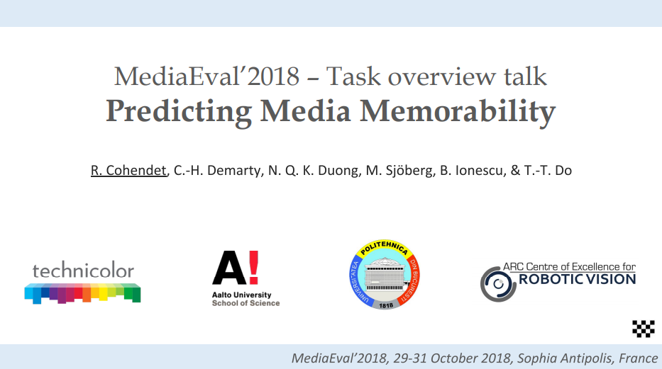

# Media Memorability Prediction

[](https://www.python.org)

[](https://jupyter.org)
[](https://www.gnu.org/licenses/gpl-3.0.html)

## Introduction



[*Predicting Media Memorability*](http://www.multimediaeval.org/mediaeval2018/memorability/index.html) task is proposed as part of the [*MediaEval 2018 Benchmarking Initiative for Multimedia Evaluation*](http://www.multimediaeval.org/mediaeval2018). The purpose of this task is the automatic prediction of multimedia content memorability. Understanding what makes a content memorable has a very broad range of current applications. Efficient memorability prediction models will also push forward the semantic understanding of multimedia content, by putting human perceptions through memorability in the center of the scene understanding.

For the task, participants will be provided with extensive datasets of multimedia content associated with memorability annotations, and with pre-extracted state-of-the-art audio-visual features. The corresponding ground truth consists of objective measures of memory performance and had been collected through recognition tests. Participants will be required to train computational models capable to infer multimedia content memorability from features of their choice. Models will be evaluated through standard evaluation metrics.

## Dataset

The full development set consists of *8000* videos, together with their corresponding *short-term* and *long-term* memorability scores.

The `data` folder only contains several sample files and videos used by the project.

### Videos

Videos were extracted from raw footage used by professionals when creating content. They are varied and contain different scenes types. All videos are released in `.webm` format, with a bit rate of *3000 kbps*. They are provided as individual files, named:

```
video<Nb>.webm
```

`<Nb>` is the number of a video.

## Ground Truth

The corresponding ground truth for the development set can be found in the file `dev-set/ground-truth.csv`. It contains one line per video, which consists of:

- The video's name.
- Its *short-term* memorability score.
- The number of annotations that was used to calculate the *short-term* memorability score.
- Its *long-term* memorability score.
- The number of annotations that was used to calculate the *long-term* memorability score.

Example:

```
video10.webm, 0.950, 34, 0.900, 10
```

## Precomputed Features

A set of pre-extracted visual features are provided to the participants to the task. Precomputed features are organized in different folders, one per feature. For the following two features, participants will find one file per video.

- *C3D*

  |    Item     | Description                                                  |
  | :---------: | :----------------------------------------------------------- |
  |   Outputs   | The final classification layer of the *3D Convolutional Neural Networks*. |
  | File Format | `.txt` file.                                                 |
  |   Feature   | A single list of numbers on one line, the dimension is *101*. |

- *HMP*

  |    Item     | Description                                                  |
  | :---------: | :----------------------------------------------------------- |
  |   Outputs   | *Histogram of Motion Patterns*.                              |
  | File Format | `.txt` file.                                                 |
  |   Feature   | A single list of pairs of numbers with format `bin:number` on one line, the dimension is *6075*. |

The next feature was extracted on three key-frames, the *first* (*0*), *one-third* (*56*) and *two-thirds* (*112*), on each video. So there are three files for each video, with names `video<Nb>-0.txt`, `video<Nb>-56.txt` and `video<Nb>-112.txt`.

- *LBP*

  |    Item     | Description                                                  |
  | :---------: | :----------------------------------------------------------- |
  |   Outputs   | *Local Binary Patterns*, calculated for patches of *8* × *15* pixels. |
  | File Format | `.txt` file.                                                 |
  |   Feature   | A single list of numbers on one line, the dimension depends on the image size. |

## Models

These models have been tested in the project:

- *Linear Regression*
- *K-Nearest Neighbors Regression*
- *Support Vector Regression*
- *Random Forest Regression*
- *AdaBoost Regression*

## Evaluation

The official evaluation metric will be the *Spearman*'s rank correlation between the predicted memorability scores and the ground-truth memorability scores computed over all test videos.

## Dependences

- [*scikit-learn*](https://scikit-learn.org/stable)
- [*pandas*](https://pandas.pydata.org)
- [*Matplotlib*](https://matplotlib.org)
- [*NumPy*](https://numpy.org)

## License

Distributed under the *GNU General Public License*. See `LICENSE` for more information.